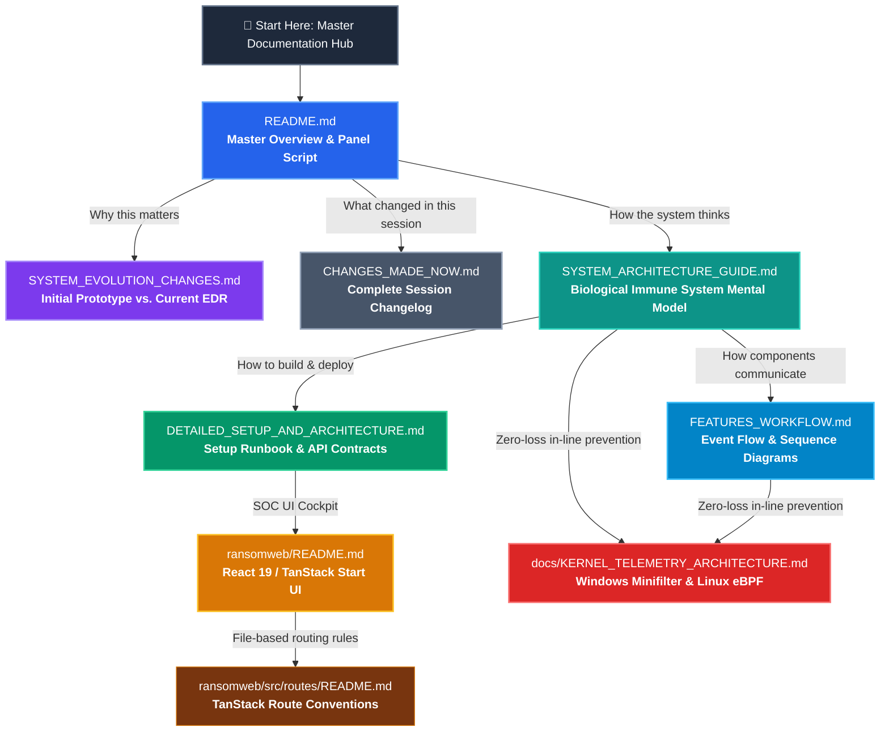
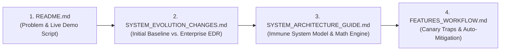
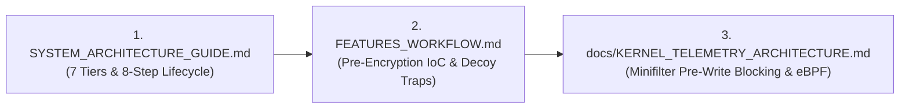
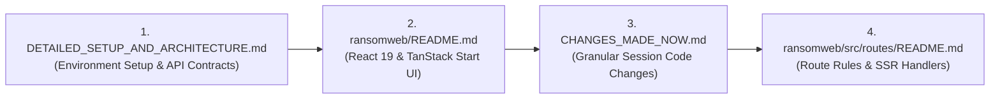
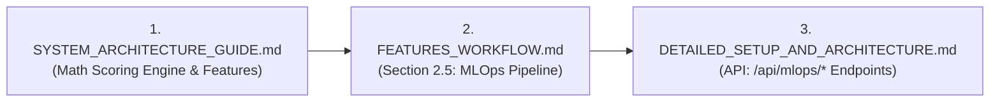

# Documentation Roadmap & Information Flow Matrix
**AI-Powered Behavioral Ransomware Detection & SOC Triage Platform (EDR)**

This document serves as the master navigation guide and visual reading roadmap for all technical documentation, architectural specifications, and implementation guides across this repository.

---

## 1. Global Documentation Flow Topology

The diagram below illustrates how all 9 Markdown (`.md`) files in the repository interconnect, from high-level executive problem statements down to low-level kernel driver specifications:

---

## 2. Role-Based Reading Journeys

Depending on your objective or role, follow one of the four curated reading tracks below:

### 🎓 Track A: Academic & Evaluation Panel Track (15-Minute Review)
*Target: University professors, project evaluators, external viva examiners, technical recruiters.*

1. **Start with [README.md](file:///d:/ransom_web/ransom_detector/README.md)**:
   - Read **Section 1 (Problem Statement)**: Understand why static antivirus fails against polymorphic ransomware.
   - Read **Section 2 (Architecture Diagram)**: Grasp the 7-tier decoupled system.
   - Review **Section 7 (Evaluation Panel & Viva Presentation Script)**: Step-by-step walkthrough covering every live demo scenario.
2. **Move to [SYSTEM_EVOLUTION_CHANGES.md](file:///d:/ransom_web/ransom_detector/SYSTEM_EVOLUTION_CHANGES.md)**:
   - Review the **Executive Transformation Matrix**: Proves how the project evolved from a monolithic script to a production-grade EDR platform.
3. **Explore [SYSTEM_ARCHITECTURE_GUIDE.md](file:///d:/ransom_web/ransom_detector/SYSTEM_ARCHITECTURE_GUIDE.md)**:
   - Inspect **The Human Body Analogy**: Grasp how Senses, Brain, Reflex, Memory, and Nervous System map to codebase modules.
   - Examine **Section 4 (Mathematical Scoring Engine)**: See the formal equations for Shannon Entropy, Rate Variance, and Random Forest weighted scoring.
4. **Conclude with [FEATURES_WORKFLOW.md](file:///d:/ransom_web/ransom_detector/FEATURES_WORKFLOW.md)**:
   - Review the **Sequence Diagram** showing the sub-second detection-to-mitigation feedback loop.

---

### 🏛️ Track B: Security Architect & Threat Researcher Track
*Target: Cybersecurity architects, SOC directors, malware analysts, threat hunters.*

1. **Start with [SYSTEM_ARCHITECTURE_GUIDE.md](file:///d:/ransom_web/ransom_detector/SYSTEM_ARCHITECTURE_GUIDE.md)**:
   - Study **Section 2 (7 Functional Tiers)** and **Section 3 (8-Step Threat Lifecycle)** from reconnaissance to post-incident memory commit.
2. **Read [FEATURES_WORKFLOW.md](file:///d:/ransom_web/ransom_detector/FEATURES_WORKFLOW.md)**:
   - Study **Section 2.1 (Canary Decoy Traps)**: Tripwire layout (`!00_passwords_vault.xlsx`), memory hashing, and zero-tolerance triggers.
   - Study **Section 2.2 (Pre-Encryption IoC Command Auditor)**: Regex inspection intercepting `vssadmin delete shadows`, `bcdedit`, and `wbadmin`.
   - Study **Section 2.3 (Active Process Mitigation)**: Thread quantum freezing via `suspend()` stopping file writes in $0$ms.
3. **Deep Dive into [docs/KERNEL_TELEMETRY_ARCHITECTURE.md](file:///d:/ransom_web/ransom_detector/docs/KERNEL_TELEMETRY_ARCHITECTURE.md)**:
   - Review the C driver specification for Windows Minifilter Driver (`fltmgr.sys` / `edr_filter.sys`) using `IRP_MJ_WRITE` pre-callbacks.
   - Review the Linux `bpf_lsm/file_open` probe architecture for kernel ring buffer streaming.

---

### 💻 Track C: Full-Stack Software Engineer & DevOps Track
*Target: Developers contributing to the Python backend, React frontend, gRPC protocol, or database.*

1. **Start with [DETAILED_SETUP_AND_ARCHITECTURE.md](file:///d:/ransom_web/ransom_detector/DETAILED_SETUP_AND_ARCHITECTURE.md)**:
   - Follow **Section 2 (Setup & Installation Instructions)**: Python virtual environment, dependencies, Protobuf compilation, and npm builds.
   - Follow **Section 3 (Terminal Execution Commands)**: Run the backend daemon, sensor agent, and Vite web dashboard.
   - Inspect **Section 4 (API Endpoints & Contracts)**: REST endpoints, WebSocket `/ws/soc`, and gRPC service definitions.
2. **Move to [ransomweb/README.md](file:///d:/ransom_web/ransom_detector/ransomweb/README.md)**:
   - Inspect the component layout, Nitro server engine, and real-time state management using TanStack Query.
3. **Consult [CHANGES_MADE_NOW.md](file:///d:/ransom_web/ransom_detector/CHANGES_MADE_NOW.md)**:
   - Itemized list of all 15+ created/modified files, phase-by-phase implementation notes, and test suite details.
4. **Review [ransomweb/src/routes/README.md](file:///d:/ransom_web/ransom_detector/ransomweb/src/routes/README.md)**:
   - Reference for TanStack Start file-based routing and SSR conventions.

---

### 🤖 Track D: MLOps & Data Science Track
*Target: Machine learning engineers, data scientists, model pipeline auditors.*

1. **Start with [SYSTEM_ARCHITECTURE_GUIDE.md](file:///d:/ransom_web/ransom_detector/SYSTEM_ARCHITECTURE_GUIDE.md)**:
   - Review **Section 4.1 & 4.2**: The 9-feature behavioral vector and the Shannon entropy formula:
     $$H(X) = -\sum_{i=0}^{255} P(x_i) \log_2 P(x_i)$$
2. **Study [FEATURES_WORKFLOW.md](file:///d:/ransom_web/ransom_detector/FEATURES_WORKFLOW.md)**:
   - Review **Section 2.5 (Continuous MLOps Pipeline)**: SQLite feedback collection, incremental retraining, metadata versioning, and zero-downtime hot-reloading.
3. **Inspect [DETAILED_SETUP_AND_ARCHITECTURE.md](file:///d:/ransom_web/ransom_detector/DETAILED_SETUP_AND_ARCHITECTURE.md)**:
   - Review `/api/mlops/feedback`, `/api/mlops/retrain`, and `/api/mlops/model-info` REST API specs.

---

## 3. Master Documentation Registry

The following table provides an exhaustive summary of all documentation files in the repository:

| Document | Location | Primary Audience | Core Focus | Reading Time |
| :--- | :--- | :--- | :--- | :---: |
| [README.md](file:///d:/ransom_web/ransom_detector/README.md) | Project Root | Everyone / Panel | Executive overview, problem statement, 7-tier architecture, test results, and live viva presentation script. | 10 mins |
| [DOCUMENTATION_FLOW.md](file:///d:/ransom_web/ransom_detector/DOCUMENTATION_FLOW.md) | Project Root | Everyone | Master information flow, reading tracks, cross-document connections, and navigation matrix *(This File)*. | 5 mins |
| [SYSTEM_ARCHITECTURE_GUIDE.md](file:///d:/ransom_web/ransom_detector/SYSTEM_ARCHITECTURE_GUIDE.md) | Project Root | Architects / Evaluators | Biological immune system analogy, 7 functional tiers, 8-step threat lifecycle, math engine, directory map. | 12 mins |
| [SYSTEM_EVOLUTION_CHANGES.md](file:///d:/ransom_web/ransom_detector/SYSTEM_EVOLUTION_CHANGES.md) | Project Root | Evaluators / Engineers | Comparative Before vs. After matrix across 8 dimensions contrasting initial prototype with current EDR. | 8 mins |
| [CHANGES_MADE_NOW.md](file:///d:/ransom_web/ransom_detector/CHANGES_MADE_NOW.md) | Project Root | Developers / Auditors | Itemized phase-by-phase changelog of every file created/modified in the transformation session. | 10 mins |
| [FEATURES_WORKFLOW.md](file:///d:/ransom_web/ransom_detector/FEATURES_WORKFLOW.md) | Project Root | Engineers / Analysts | Mermaid sequence diagram, canary traps, IoC auditor, active mitigation, gRPC streaming, MLOps loop. | 10 mins |
| [DETAILED_SETUP_AND_ARCHITECTURE.md](file:///d:/ransom_web/ransom_detector/DETAILED_SETUP_AND_ARCHITECTURE.md) | Project Root | DevOps / Developers | Prerequisites, installation, terminal execution commands, distributed tiers, and REST/WS/gRPC API contracts. | 12 mins |
| [docs/KERNEL_TELEMETRY_ARCHITECTURE.md](file:///d:/ransom_web/ransom_detector/docs/KERNEL_TELEMETRY_ARCHITECTURE.md) | `docs/` | Kernel Devs / Researchers | Windows Minifilter driver (`fltmgr.sys`), Linux eBPF LSM probes, IPC ring buffers, anti-BSOD safeguards. | 15 mins |
| [ransomweb/README.md](file:///d:/ransom_web/ransom_detector/ransomweb/README.md) | `ransomweb/` | Frontend Engineers | React 19, TanStack Start, Tailwind CSS, real-time gauges, incident reporting modal, file scanner. | 5 mins |
| [ransomweb/src/routes/README.md](file:///d:/ransom_web/ransom_detector/ransomweb/src/routes/README.md) | `ransomweb/src/routes/` | Frontend Engineers | TanStack Start file-based routing conventions, URL segments, dynamic params, and layout rules. | 2 mins |

---

## 4. Per-Document Deep Dive & Content Map

### 📄 1. [README.md](file:///d:/ransom_web/ransom_detector/README.md)
* **Status**: Primary Project Landing Page & Panel Guide
* **Key Highlights**:
  - Executive problem statement contrasting static AV with behavioral EDR.
  - High-level Mermaid architecture diagram.
  - 5 Phase feature checklist (Active Mitigation, Async DB, gRPC, Canary/IoC Traps, MLOps).
  - Quickstart commands for backend, agent, and frontend.
  - Verification badge showing **37/37 passing unit & integration tests**.
  - Complete, turn-by-turn **Evaluation Panel & Viva Presentation Script** with expected panel Q&A answers.

### 📄 2. [SYSTEM_ARCHITECTURE_GUIDE.md](file:///d:/ransom_web/ransom_detector/SYSTEM_ARCHITECTURE_GUIDE.md)
* **Status**: Conceptual & Engineering System Manual
* **Key Highlights**:
  - **The Human Body Analogy**: Visual table equating Senses, Brain, Reflex, Memory, Nervous System, and Cockpit to specific source files.
  - **7 Functional Tiers**: Clear ASCII diagram tracing Tier 1 (Sensors) through Tier 7 (MLOps).
  - **8-Step Threat Lifecycle**: Detailed event walkthrough from reconnaissance to alert archiving.
  - **Mathematical Scoring Engine**: Exact mathematical formulations for Shannon Entropy, Burst Rate Variance, and Composite Risk Score:
    $$\text{Risk} = 0.55 \cdot \text{Score}_{\text{rules}} + 0.45 \cdot P(\text{Ransomware}_{\text{ML}})$$
  - **Project Directory Structure Map**: Explains the organizational role of every folder in the repo.

### 📄 3. [SYSTEM_EVOLUTION_CHANGES.md](file:///d:/ransom_web/ransom_detector/SYSTEM_EVOLUTION_CHANGES.md)
* **Status**: Before-vs-After Evolution Matrix
* **Key Highlights**:
  - Direct 8-point comparison table contrasting the initial prototype against the current platform.
  - Deep-dive sections detailing:
    - How alerts shifted from passive logs to instant `<150ms` process tree suspension and termination.
    - How communication shifted from local in-memory queues to binary gRPC HTTP/2 Protobuf streaming.
    - How storage evolved from volatile RAM lists to an asynchronous SQLAlchemy relational schema.
    - How testing grew from 0 automated tests to 37 multi-suite unit and integration tests.

### 📄 4. [CHANGES_MADE_NOW.md](file:///d:/ransom_web/ransom_detector/CHANGES_MADE_NOW.md)
* **Status**: Complete Session Changelog
* **Key Highlights**:
  - Granular breakdown of Phase 1 through Phase 5 code changes.
  - Exact file paths created (`backend/mitigation.py`, `backend/websocket_manager.py`, `backend/database.py`, `backend/repository.py`, `backend/grpc_server.py`, `agent/edr_agent.py`, `core/canary.py`, `core/ioc_auditor.py`, `mlops/retrain_pipeline.py`, etc.).
  - Complete record of the 6 test suites created in `tests/`.

### 📄 5. [FEATURES_WORKFLOW.md](file:///d:/ransom_web/ransom_detector/FEATURES_WORKFLOW.md)
* **Status**: End-to-End Operational Lifecycle
* **Key Highlights**:
  - Full Mermaid sequence diagram showing asynchronous message flow across 9 system components.
  - Feature-by-feature operational mechanics:
    - Canary bait placement and hash monitoring.
    - Pre-encryption IoC command line evaluation (intercepting shadow copy deletion).
    - Emergency process freeze and recursive tree kill.
    - gRPC bidirectional telemetry and directive streaming.
    - Continuous MLOps analyst feedback loop and model hot-reloading.

### 📄 6. [DETAILED_SETUP_AND_ARCHITECTURE.md](file:///d:/ransom_web/ransom_detector/DETAILED_SETUP_AND_ARCHITECTURE.md)
* **Status**: Practical Runbook & API Reference
* **Key Highlights**:
  - Multi-tier system diagram showing port numbers and data protocols.
  - Prerequisites and step-by-step installation instructions for Windows and Linux.
  - Ready-to-copy terminal execution commands for all platform processes.
  - Complete REST, WebSocket, and gRPC API contract specifications with sample request and response payloads.

### 📄 7. [docs/KERNEL_TELEMETRY_ARCHITECTURE.md](file:///d:/ransom_web/ransom_detector/docs/KERNEL_TELEMETRY_ARCHITECTURE.md)
* **Status**: Advanced Low-Level Kernel Specification
* **Key Highlights**:
  - Windows Minifilter Driver (`fltmgr.sys`) C code blueprint registering `IRP_MJ_WRITE` and `IRP_MJ_CREATE` pre-operation callbacks.
  - Linux eBPF LSM probe implementation using `bpf_lsm/file_open` to block malicious file access with `-EPERM`.
  - Kernel-to-user space IPC design utilizing circular memory-mapped ring buffers (`FilterSendMessage` / `bpf_ringbuf`).
  - Anti-BSOD stability safeguards (IRQL level rules, pool allocation hygiene, watchdogs).

### 📄 8. [ransomweb/README.md](file:///d:/ransom_web/ransom_detector/ransomweb/README.md)
* **Status**: Frontend Dashboard Guide
* **Key Highlights**:
  - Overview of the React 19 + TanStack Start SOC cockpit.
  - Guide to real-time visual components (Risk Dial Gauge, 5-Stage Pipeline Tracker, Live Evidence Feed).
  - Forensic incident inspection modal and one-click JSON report export.
  - 1MB chunked streaming file scanner interface.

### 📄 9. [ransomweb/src/routes/README.md](file:///d:/ransom_web/ransom_detector/ransomweb/src/routes/README.md)
* **Status**: Frontend Routing Convention
* **Key Highlights**:
  - Explanation of TanStack Start file-based routing.
  - URL mapping table for static, dynamic (`$id`), optional, and splat routes.

---

## 5. Frequently Asked Questions & Quick Jump Guide

| If you want to know... | Jump To This Document |
| :--- | :--- |
| **"How do I present this project to an evaluation panel?"** | [README.md (Section 7)](file:///d:/ransom_web/ransom_detector/README.md#7-evaluation-panel--viva-presentation-script) |
| **"How does this project differ from our initial prototype?"** | [SYSTEM_EVOLUTION_CHANGES.md](file:///d:/ransom_web/ransom_detector/SYSTEM_EVOLUTION_CHANGES.md) |
| **"What is the mathematical equation for entropy and risk?"** | [SYSTEM_ARCHITECTURE_GUIDE.md (Section 4)](file:///d:/ransom_web/ransom_detector/SYSTEM_ARCHITECTURE_GUIDE.md#4-mathematical-detection-engine--scoring-logic) |
| **"How does the system stop ransomware in zero milliseconds?"** | [FEATURES_WORKFLOW.md (Section 2.3)](file:///d:/ransom_web/ransom_detector/FEATURES_WORKFLOW.md#23-active-process-mitigation--containment) |
| **"What commands do I run to start the server, agent, and UI?"** | [DETAILED_SETUP_AND_ARCHITECTURE.md (Section 3)](file:///d:/ransom_web/ransom_detector/DETAILED_SETUP_AND_ARCHITECTURE.md#3-step-by-step-execution-commands) |
| **"What exact files were modified or created in this session?"** | [CHANGES_MADE_NOW.md](file:///d:/ransom_web/ransom_detector/CHANGES_MADE_NOW.md) |
| **"How would this run as a Windows kernel driver or eBPF?"** | [docs/KERNEL_TELEMETRY_ARCHITECTURE.md](file:///d:/ransom_web/ransom_detector/docs/KERNEL_TELEMETRY_ARCHITECTURE.md) |
| **"How does the React 19 SOC dashboard work?"** | [ransomweb/README.md](file:///d:/ransom_web/ransom_detector/ransomweb/README.md) |
