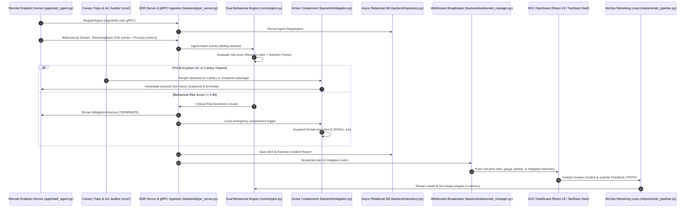

# Enterprise EDR Platform — Feature Workflow & Incident Lifecycle

This document details the complete end-to-end operational workflow of the **AI-Powered Behavioral Ransomware Detection & SOC Triage Platform (EDR)**, explaining how endpoint sensors, binary streaming protocols, behavioral detection engines, active defense killswitches, relational persistence, and the SOC web dashboard interact.

---

## 1. End-to-End Architectural Workflow

---

## 2. Core Feature Workflows

### 2.1 Decoupled Telemetry Ingestion (gRPC Streaming)
1. **Agent Registration**:
   - Remote sensors (`agent/edr_agent.py`) start on endpoints and connect to `backend/grpc_server.py` on port `50051`.
   - The agent invokes `RegisterAgent` passing hostname, IP address, OS platform, and agent version.
   - The server registers the agent in `edr_storage.db` via `EDRRepository.register_agent` and issues an active session token.
2. **Streaming Telemetry Ingestion**:
   - The agent continuously monitors filesystem mutations via `watchdog` and samples active process CPU/IO/threads via `psutil`.
   - Telemetry is batched into `TelemetryBatch` Protocol Buffer envelopes and streamed over HTTP/2.
   - The server feeds batches directly into `BehavioralEngine`'s sliding window without file system lag.

---

### 2.2 Dual-Layer Behavioral Detection Engine
The behavioral engine evaluates running processes across a sliding temporal window (default: $10$ seconds) across **9 behavioral dimensions**:

1. `file_op_rate`: Frequency of file writes/modifications per second.
2. `mean_entropy`: Average Shannon entropy of touched files (0.0 to 8.0 bits/byte).
3. `high_entropy_fraction`: Percentage of touched files with entropy $\ge 7.50$.
4. `ext_change_rate`: Rename velocity per second.
5. `suspicious_ext_rate`: Frequency of renames to known ransomware extensions (`.locked`, `.crypto`, etc.).
6. `cpu_percent`: Process CPU utilization.
7. `children_spawned`: Subprocess fan-out count.
8. `io_bytes_per_s`: Storage throughput.
9. `touched_file_count`: Distinct files mutated in the window.

#### Scoring Engine:
- **Heuristic Rule Layer (`RuleEngine`)**: Fast, explainable spike detector checking for simultaneous entropy jumps ($\ge 7.5$), mass write operations ($\ge 3$/sec), and suspicious extension alterations.
- **Machine Learning Layer (`MLScorer`)**: Consumes the 9-dimensional vector using a `RandomForestClassifier` trained to differentiate normal office workloads (compilers, text editors) from automated encryption loops.
- **Ensemble Combined Score**:
  $$\text{Risk Score} = w_{\text{rule}} \times \text{RuleScore} + w_{\text{ml}} \times \text{MLScore}$$

---

### 2.3 Active Threat Mitigation & Containment
When an evaluated risk score crosses the critical threshold ($\ge 0.80$) or proactive tripwires trigger:
1. **Thread Quantum Freezing**:
   - `ProcessMitigator.terminate_process_tree()` discovers all children recursively.
   - Calls `process.suspend()` across every thread in the tree.
   - **Benefit**: Encryption stops in $0$ms remaining execution time before filesystem write handles complete.
2. **Graduated Termination**:
   - Sends `SIGTERM` to allow clean handle release.
   - Evaluates process exit status; if processes do not exit within $1.5$ seconds, escalates to `SIGKILL`.
3. **Audit & WebSocket Broadcast**:
   - Full mitigation telemetry (terminated PIDs, execution time in milliseconds, trigger reason) is pushed over the `mitigation` WebSocket channel and persisted in the database.

---

### 2.4 Proactive Traps & Sensor Hardening

#### 1. Canary Bait File Traps (`core/canary.py`)
- Automatically seeds decoy files prefixed alphabetically (`!00_passwords_vault.xlsx`, `!00_confidential_financials.docx`) in monitored directories.
- Records initial SHA-256 hashes.
- Because ransomware enumerates directories alphabetically to maximize victim impact, it targets the canary files first.
- The instant a canary's content, hash, or filename changes, the tripwire fires an emergency termination command against the tampering process before legitimate user documents are touched.

#### 2. Pre-Encryption IoC Auditing (`core/ioc_auditor.py`)
- Audits active process command-line arguments against precursor sabotage techniques mapped to **MITRE ATT&CK**:
  - `T1490` (Inhibit System Recovery): `vssadmin delete shadows`, `wmic shadowcopy delete`, `wbadmin delete catalog`, `bcdedit /set recoveryenabled No`.
  - `T1070.001` (Indicator Removal: Clear Event Logs): `wevtutil cl Security`.
  - `T1489` (Service Stop): `net stop vss`, `net stop sql`.
- Neutralizes the adversary before file encryption can begin.

---

### 2.5 Bounded-Memory Streaming File Triage Scanner (`backend/scan_router.py`)
- Accepts artifact uploads via `POST /api/scan`.
- Streams file payloads in **1MB chunks** up to a strict 50MB ceiling (`HTTP 413`).
- **$O(1)$ Constant-Memory Shannon Entropy**:
  - Employs an online 256-bin frequency histogram.
  - Updates frequency counts incrementally per byte chunk without storing the full file in RAM.
  - Formula:
    $$H = -\sum_{i=0}^{255} p_i \log_2(p_i)$$
- Magic byte detection classifies file signatures (`MZ`, `ELF`, `PK`, `PDF`, `7z`, `GZIP`).
- Evaluates the artifact with heuristics and the Random Forest model to assign an immediate verdict (`clean`, `suspicious`, `malicious`).

---

### 2.6 State Persistence & Relational Schema
All platform events are persisted asynchronously via SQLAlchemy 2.0 in `edr_storage.db` (or PostgreSQL):
- `agents`: Endpoint inventory, IP addresses, OS platforms, online/offline status, and heartbeat timestamps.
- `alerts`: Security alerts with severity, risk scores, rule/ML breakdown, and affected paths.
- `incident_reports`: Forensic reports detailing incident mode, duration, feature vectors, event timelines, and recommendations.
- `scans`: Artifact triage scan history.
- `analyst_feedback`: Human analyst triage validations.
- `telemetry_events`: Raw filesystem and process telemetry stream archival.

---

### 2.7 Continuous MLOps Retraining Loop (`mlops/retrain_pipeline.py`)
1. **Analyst Ground Truth Submission**:
   - SOC analysts submit True Positive or False Positive labels via `POST /api/ml/feedback`.
2. **Continuous Retraining Pipeline**:
   - `POST /api/ml/retrain` triggers the retraining engine.
   - Synthesizes baseline distributions augmented with weighted analyst feedback records.
   - Trains a new `RandomForestClassifier` with cross-validation.
   - Evaluates accuracy, precision, recall, and F1 score.
   - Saves versioned model artifacts (`rf_classifier_v2.<timestamp>.pkl`).
   - Updates `models/model_metadata.json`.
   - **Zero-Downtime Hot Reload**: Dynamically updates the in-memory model weights of the active behavioral engine and file scanner without restarting the server.

---

### 2.8 Real-Time SOC Dashboard (`ransomweb/`)
The React 19 / TanStack Start web interface provides sub-second visibility into all platform tiers:
- **Status Pill & Health Bar**: Displays pipeline state, uptime, and active collector/model status.
- **5-Stage Pipeline Progress Tracker**: Real-time visualization of detection stages (`collecting` $\rightarrow$ `feature-extraction` $\rightarrow$ `scoring` $\rightarrow$ `correlating` $\rightarrow$ `reporting`).
- **Interactive Risk Score Gauge**: Visual dial displaying instantaneous behavioral risk.
- **Live Evidence Feed**: Granular behavioral anomaly log with severity tags.
- **Incident Reports Table & Modal**: Chronological timeline playback, feature inspection, and **JSON Export** for SOC reporting.
- **Integrated File Scanner**: Drag-and-drop artifact scanner with automated AI-assisted threat triage (MITRE ATT&CK mappings, likely malware family, and containment guidance).
- **Workload Detonation Controls**: Single-click trigger for `Run Benign` or `Run Attack` simulation workflows.
